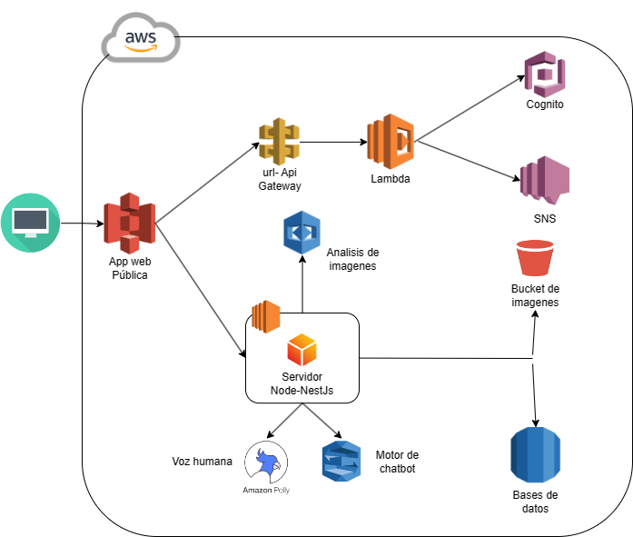

# Manual Técnico 🗒️

## Objetivos

1. **Mejorar la experiencia del pasajero:** Facilitar el registro de vuelos, la compra de boletos y el check-in de los pasajeros para agilizar y mejorar su experiencia en el aeropuerto.

2. **Garantizar la seguridad operativa:** Implementar medidas de seguridad eficientes y tecnológicamente avanzadas para garantizar la seguridad de las operaciones aeroportuarias, incluido el control de acceso y la vigilancia.

3. **Optimizar la eficiencia operativa:** Utilizar tecnología para mejorar la eficiencia de las operaciones aeroportuarias, como la gestión automatizada de vuelos y la visualización de detalles de vuelos reservados para el personal y los pasajeros.

## Descripción

Este proyecto se enfoca en el desarrollo de un sistema completo y robusto de gestión y seguridad diseñado específicamente para aeropuertos, con el objetivo principal de proporcionar una experiencia sin inconvenientes para los pasajeros. La plataforma abarca diversas funcionalidades, desde el registro de vuelos hasta el proceso de check-in de los pasajeros, pasando por la compra de boletos. Además de facilitar estas acciones clave para los viajeros, el sistema también está diseñado para garantizar la seguridad de las operaciones aeroportuarias mediante la implementación de medidas de control de acceso avanzadas, sistemas de vigilancia inteligente y protocolos de seguridad mejorados. Al optimizar la experiencia del usuario y fortalecer la seguridad operativa, el sistema busca mejorar significativamente la eficiencia global de las operaciones aeroportuarias, reduciendo los tiempos de espera, optimizando la asignación de recursos y brindando una gestión más efectiva de los vuelos programados.

## Arquitectura implementada

## Prespuesto utilizado

Como primer lanzamiento, basandonos en los precios por utilización de los servicios, el proyecto como tal esta manejando un minimo de 100 usuarios activos al mes, por lo cuál:

| Servicio        | Detalle                              | Precio   |
| --------------- | ------------------------------------ | -------- |
| AWS Cognito     | Autenticación de usuarios            | $50 USD  |
| AWS Lambda      | Ejecución de funciones               | $20 USD  |
| AWS API Gateway | Gestión de API                       | $30 USD  |
| AWS Lex         | Procesamiento de lenguaje natural    | $50 USD  |
| AWS Rekognition | Análisis de imágenes                 | $30 USD  |
| AWS Polly       | Síntesis de voz                      | $20 USD  |
| AWS EC2         | Instancias de servidor               | $100 USD |
| AWS S3          | Almacenamiento de objetos            | $40 USD  |
| AWS RDS         | Servicio de base de datos relacional | $80 USD  |
| AWS SNS         | Servicio de notificaciones           | $10 USD  |

Por lo tanto, el presupuesto mensual para Kehuel Airlines proyectado para 100 usuarios activos al mes es:

| Detalle                               | Total        |
| ------------------------------------- | ------------ |
| **Por usuarios activos mensualmente** | **$430 USD** |

> [!NOTE]
> El precio estimado varía dependiendo la cantidad de usuarios y el alcance que el proyecto tendra. Todos los precios por utilizacion de cada servicio, han sido extraidos de la pagina oficil de Amazon Web Services. [AWS](https://aws.amazon.com/es/pricing/?nc2=h_ql_pr_ln&aws-products-pricing.sort-by=item.additionalFields.productNameLowercase&aws-products-pricing.sort-order=asc&awsf.Free%20Tier%20Type=*all&awsf.tech-category=*all)

## Servicios utilizados:

- **AWS Cognito:** Es un servicio que permite agregar funcionalidades de autenticación y autorización a las aplicaciones web y móviles de forma sencilla. Proporciona funciones como el registro de usuarios, inicio de sesión seguro, gestión de usuarios y federación de identidades.

- **AWS Lambda:** Es un servicio de cómputo sin servidor que te permite ejecutar código en respuesta a eventos sin tener que aprovisionar ni administrar servidores. Puedes ejecutar código en casi cualquier lenguaje de programación sin preocuparte por la infraestructura subyacente.

- **AWS API Gateway:** Es un servicio completamente gestionado que facilita la creación, publicación, mantenimiento, supervisión y protección de API a cualquier escala. Permite crear API RESTful y WebSocket que actúan como puntos de entrada para las aplicaciones en la nube.

- **AWS Lex:** Es un servicio de reconocimiento y comprensión del lenguaje natural (NLU) que permite crear interfaces de conversación de forma rápida y sencilla. Se utiliza para crear chatbots y aplicaciones de voz que pueden comprender los comandos y responder a las consultas de los usuarios de manera natural.

- **AWS Rekognition:** Es un servicio de análisis de imágenes y vídeos basado en inteligencia artificial que puede identificar objetos, personas, texto, escenas y actividades en imágenes y vídeos. Se utiliza para análisis de contenido multimedia, reconocimiento facial, análisis de contenido inapropiado, entre otros.

- **AWS Polly:** Es un servicio que convierte texto en voz realista utilizando tecnología de síntesis de habla avanzada. Permite crear aplicaciones que pueden hablar con voces naturales en varios idiomas y géneros.

- **AWS EC2:** Es un servicio de computación en la nube que proporciona capacidad informática escalable en la nube. Permite ejecutar aplicaciones en servidores virtuales, conocidos como instancias EC2, y escalar la capacidad de computación según sea necesario.

- **AWS S3:** Es un servicio de almacenamiento en la nube altamente escalable y duradero. Permite almacenar y recuperar datos de forma segura desde cualquier lugar y en cualquier momento a través de internet.

- **AWS RDS:** Es un servicio de base de datos relacional gestionado que facilita la configuración, operación y escalado de bases de datos relacionales en la nube. Admite varios motores de bases de datos, como MySQL, PostgreSQL, Oracle y SQL Server.

- **AWS SNS:** Es un servicio de mensajería completamente administrado que permite enviar mensajes desde aplicaciones distribuidas a través de varios canales, como SMS, correo electrónico, HTTP/S y más. Se utiliza para la entrega de notificaciones, alertas y mensajes a los usuarios finales.
