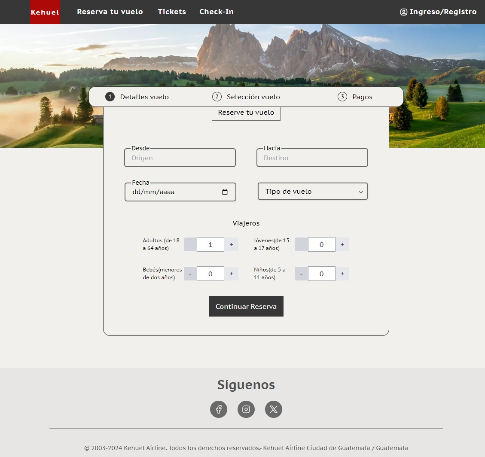
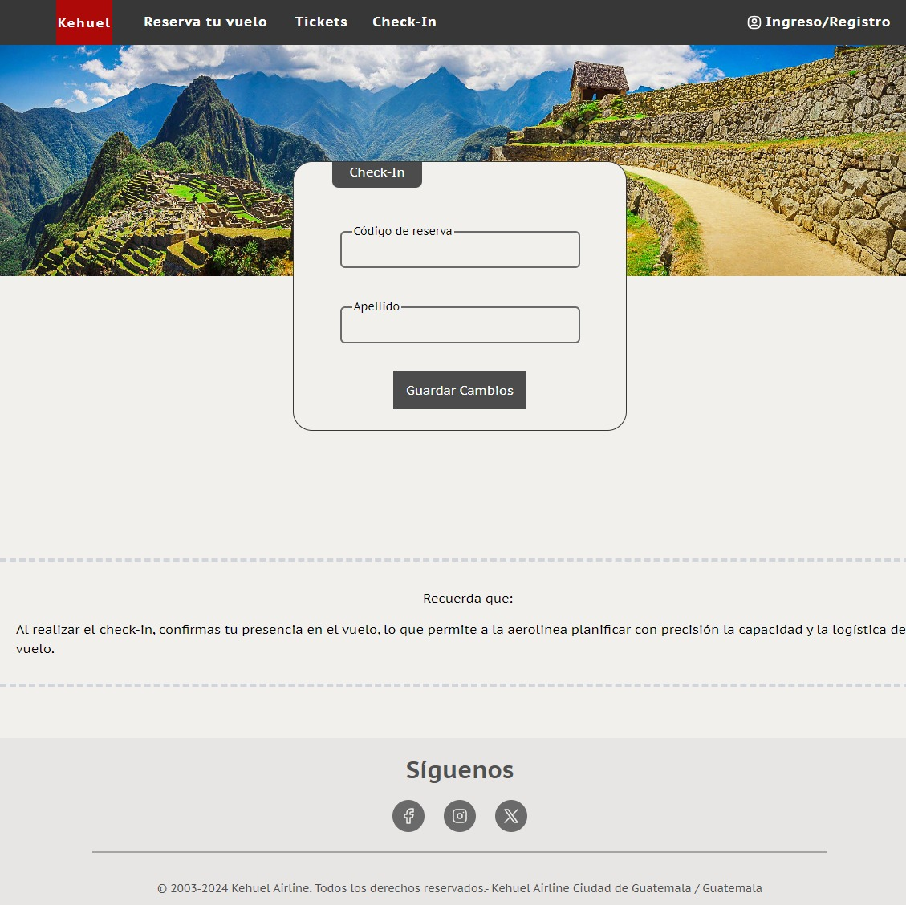

# Kehuel Airlines ✈️

## Objetivos

1. **Comprensión del sistema:** Explicar claramente todas las funcionalidades disponibles y proporcionar instrucciones detalladas paso a paso sobre cómo utilizarlas.

2. **Promoción de la seguridad y el cumplimiento:** Incluir pautas claras sobre las medidas de seguridad implementadas y cómo los usuarios deben cumplir con los protocolos de seguridad establecidos.

3. **Optimización de la eficiencia y la gestión:** Proporcionar consejos y mejores prácticas para optimizar la eficiencia en el uso de la plataforma, incluyendo sugerencias sobre cómo reducir los tiempos de espera y gestionar los recursos de manera más efectiva.

## Descripción

La aplicación proporciona una solución integral para la gestión y seguridad de aeropuertos, ofreciendo una experiencia fluida a los pasajeros. Desde el registro de vuelos hasta el proceso de check-in, los usuarios disfrutan de un acceso eficiente a las diversas funcionalidades. Además, la aplicación garantiza la seguridad de las operaciones aeroportuarias mediante la implementación de medidas avanzadas de control de acceso y sistemas de vigilancia inteligente. Su objetivo es optimizar la experiencia del usuario, fortaleciendo la seguridad operativa y mejorando la eficiencia global de las operaciones aeroportuarias.

## Utilización

### Administradores:

Para poder ingresar al sistema como administrador es necesario ingresar las credenciales proporcionadas por Kehuel Airlines para administradores en el Inicio de Sesión del sistema.

Al ingresar como administradores se presenta el siguiente dashboard

En este espacio, el adminsitrador debera registrar los vuelos que presentara a los pasajeros al momento de que estos deseen reservar un vuelo, y realizar cualquier otra funcionalidad de la aplicación, ademas de ver la descripción de este.

---

### **Pasajeros:**

1. **Dashboard Principal**

   Al ingresar a la página principal se observa el siguien menu, con ciertas funcionalidades que explicaremos a continuación:

   

2. **Reservación de vuelo**

   El ingresar al apartado que se encuentra en la parte superior de la aplicacion "Reserva tu vuelo", se muestran 3 pestañas en las que el usuario debera llenar la información y seleccionar las opciones que se le indica

3. **Detalles de Vuelo**

   En esta dash el pasajero debera ingresar el origen y destino de su vuelo, ademas de ingresar datos de los viajeros, tales como:

   - Cantidad de adultos (18 a 67 años)
   - Cantidad de jovenes (15 a 17 años)
   - Cantidad de niños (5 a 11 años)
   - Cantidad de bebes (Menores de 2 años)

   Una vez ingresada esta información el usuario podra avanzar a la siguiente pestaña de reservación de vuelo.

   

4. **Seleccion de vuelo**

   En este apartado se le presentara al usuario distintas opciones de viaje, dependiendo el destino y origen que este haya seleccionado en el dash anterior.

   El usuario debera seleccionar el vuelo que mas le convenga teniendo en cuenta, la fecha, hora y precio del mismo.

   

   Una vez seleccionado el vuelo, el usuario podra avanzar a la ultima pestaña de reservación de vuelo.

5. **Pagos**

   En esta última pestaña se le muestra al usuario un resúmen de la información que este haya ingresado, adjuntado su precio total para que el usuario pueda observar si esta de acuerdo con el cobro.

   En la parte inferior el usuario debera ingresar los datos de su Tarjeta de Crédito o Débito para cubrir con el monto actual.

   

   Una vez ingresada esta información el usuario podra finalizar su reserva lo cuál le generara un código de vuelo.

6. **Check-In**

   En esta pestaña el usuario podra confirmar su estadia obligatoria en el vuelo que ha reservado para indicarle a Kehuel se presencia en dicho vuelo, por lo cuál se muestra el siguiente dashboard:

   

   El usuario debera ingresar el código de vuelo generado por su reserva y su apellido para realizar check-in de ese vuelo.

Una vez que el usuario haya ingresado todos estos datos, el usuario tendra la posibilidad de crear una cuenta personal en Kehuel Airlines, para poder ingresar al sistema y ver información y tener la capacidad de utilizar otras funciones. Para realizar esto se debe seleccionar la opción `Ingreso/Registro` en la parte superior del dashboard principal.

1. **Crear cuenta**

   

   El usuario debera ingresar cada uno de los datos que se solicita y al registrarse e iniciar sesión con la cuenta creada, se le mostrara un resumen de su perfil.

2. **Perfil de usuario**

   

3. **Viajes**

   Dentro de su perfil el usuario podra visualizar los viajes que ha reservado dentro de Kehuel Airlines, con todo el contenido y detalles de los mismos

   

4. **Destinos**

   Dentro de su perfil el usuario podra visualizar los destinos que se encuentran disponibles.

   

5. **Destino**

   Luego de seleccionar uno de los muchos destinos, se desplegará información importante respecto
   al destino.

   
